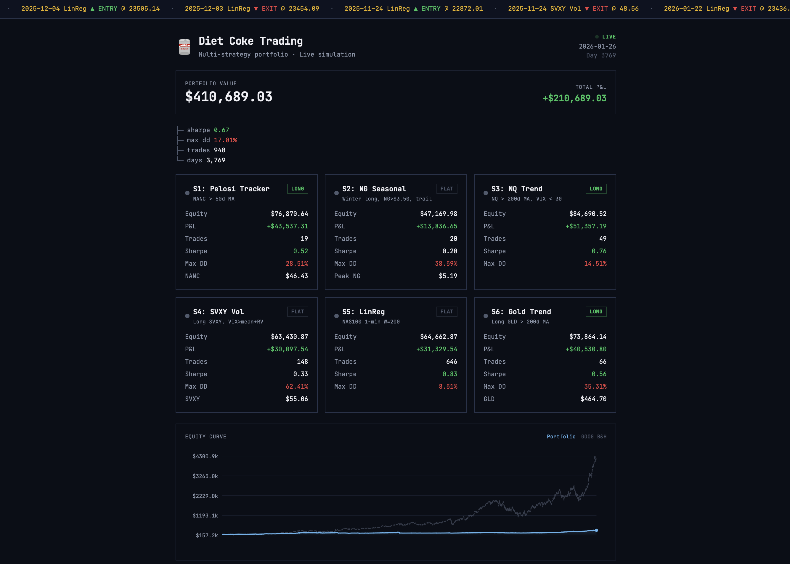

# Diet Coke Trading

A multi-strategy quantitative trading system with live simulation and a real-time web dashboard. Written in [UIUA](https://www.uiua.org/) (array programming language) with a Next.js frontend.



## Overview

Diet Coke Trading runs 6 independent strategies across commodities, equities, and volatility, managed as an equal-weight portfolio with Grossman-Zhou drawdown control. The system fetches live market data from FRED, EIA, and other APIs, executes trading logic every 30 minutes, and serves a dark-themed dashboard at `localhost:8080`.

**Starting capital:** $200,000 ($33.3k per strategy)

### Strategies

| # | Strategy | Signal | Backtest Sharpe |
|---|----------|--------|-----------------|
| S1 | Pelosi Tracker | NANC ETF > 50d MA | -- |
| S2 | NG Seasonal | Long NG in winter (Oct-Mar), NG > $3.50, 25% trail stop | 0.71 |
| S3 | NQ Trend | NASDAQ > 200d MA, VIX < 30 | 0.66 |
| S4 | SVXY Vol | Long SVXY, VIX > mean + realized vol | -- |
| S5 | LinReg | NAS100 linear regression slope W=200 | 1.45 |
| S6 | Gold Trend | Long Gold > 200d MA | -- |

### Portfolio Backtest (3-strategy subset, 1997-2026)

```
Sharpe Ratio:   0.79
Max Drawdown:   15.8%
Ann. Return:    7.45%
Total Return:   649%
```

## Quick Start

**Prerequisites:** [Bun](https://bun.sh/), [UIUA](https://www.uiua.org/)

```bash
# Run the daemon (HTTP server + live.ua scheduler)
./serve.sh run

# Dashboard available at:
open http://localhost:8080/web/out/index.html
```

### Daemon Management

```bash
./serve.sh run          # Run in foreground
./serve.sh install      # Install as macOS launchd agent (auto-start on login)
./serve.sh uninstall    # Remove launchd agent
./serve.sh status       # Check if running
./serve.sh logs         # Tail daemon log
./serve.sh dev          # Daemon + Next.js dev server (hot reload)
```

### Run Backtests

```bash
uiua run main.ua           # Full pipeline (Variant G: NG>$3.50 + double stop)
uiua run portfolio.ua       # 3-strategy portfolio backtest
uiua run optimize.ua        # Parameter sweep (13 variants)
```

## Architecture

```
                  FRED / EIA / CSV APIs
                         │
                    ┌────▼────┐
                    │ daemon.ts│  Bun: HTTP server (port 8080)
                    │          │  + data refresh + live.ua scheduler (30 min)
                    └────┬────┘
                         │
              ┌──────────▼──────────┐
              │      live.ua        │  6 strategies, GZ drawdown control,
              │   (UIUA runtime)    │  quarterly rebalancing
              └──────────┬──────────┘
                         │
                  data/live/*.json    State, equity, events
                         │
              ┌──────────▼──────────┐
              │     web/ (Next.js)  │  Static export, Tailwind CSS,
              │    SVG equity chart │  dark theme, 30s polling
              └─────────────────────┘
```

## Project Structure

### Core Trading (UIUA)

| File | Purpose |
|------|---------|
| `main.ua` | Full pipeline: data → strategy → backtest → metrics |
| `data.ua` | Load CSVs, align by date |
| `strategy.ua` | Compute ratio, signals, positions |
| `backtest.ua` | Simulate trades, equity curve |
| `metrics.ua` | Performance stats + summary table |
| `live.ua` | Live simulation: 6 strategies, FRED/CSV fetch, GZ drawdown, rebalancing |

### Optimization (UIUA)

| File | Purpose |
|------|---------|
| `optimize.ua` | 13 parameter/strategy variants |
| `optimize_vol.ua` | Vol scaling (counterproductive) |
| `optimize_duration.ua` | Duration limits + transaction costs |
| `optimize_momentum.ua` | Momentum window sweep 1-10 days |
| `optimize_stops.ua` | 4 stop-loss strategies x 5 params |
| `optimize_combined.ua` | 2D sweep: momentum x stops |
| `optimize_adaptive.ua` | Adaptive exits + proportional recovery |
| `optimize_regime.ua` | Coal switching + heating oil seasonal |
| `optimize_ngfilter_stops.ua` | NG > $3.50 filter x stop combinations (best results) |
| `optimize_trend.ua` | Macro trend filters (all hurt Sharpe) |
| `optimize_nasdaq.ua` | NASDAQ signal variants (5 MA types) |
| `optimize_seasonal.ua` | NG seasonal drawdown mitigation (7 variants) |
| `optimize_accel.ua` | Second derivative trading on daily NASDAQ |
| `optimize_hft.ua` | LinReg slope on hourly QQQ |
| `optimize_hft_min.ua` | LinReg slope on 1-minute NAS100 |
| `portfolio.ua` | Multi-strategy portfolio backtester |
| `test_startdate.ua` | Sharpe by start year (structural shift analysis) |

### Infrastructure

| File | Purpose |
|------|---------|
| `daemon.ts` | Bun daemon: HTTP + data refresh + scheduler |
| `serve.sh` | Daemon management CLI |
| `download_svxy.ts` | Fetch SVXY daily CSV |
| `download_gold.ts` | Fetch Gold daily CSV |
| `com.crudeoilandgas.daemon.plist` | macOS launchd agent template |

### Web Dashboard

| File | Purpose |
|------|---------|
| `web/app/page.tsx` | Full dashboard: balance, strategy cards, equity chart, event log |
| `web/app/layout.tsx` | Root layout, JetBrains Mono font |
| `web/app/globals.css` | Tailwind dark theme |
| `web/lib/types.ts` | TypeScript types for JSON data |
| `web/lib/data.ts` | Fetch + parse functions |

## Key Findings

**40+ strategy variants tested.** The most important discoveries:

- **Momentum filter is the key improvement** over baseline (Sharpe 0.32 → 0.42). 2-day reversal confirmation before entry.
- **NG > $3.50 filter** counterintuitively works: high-NG-price deviations are more likely cyclical (temporary) than structural.
- **Vol scaling is counterproductive** for mean reversion — sizes down when the signal is strongest.
- **Duration limits hurt** — the strategy profits from holding through the full reversion cycle (avg 193 days).
- **Stop-losses help** — trail/ratio stops reduce MaxDD ~8pp while maintaining Sharpe.
- **Post-2009 structural shift** is real: shale gas revolution permanently decoupled NG/WTI. Post-2010 Sharpe jumps from 0.42 → 0.53.
- **W=50 is a universal sweet spot** for LinReg slope signals regardless of bar frequency.

## Data Sources

| Source | Data |
|--------|------|
| FRED API | NG (DHHNGSP), WTI (DCOILWTICO), NASDAQ (NASDAQCOM), Heating Oil (DHOILNYH) |
| EIA API | NG futures term structure (RNGC1-4), storage |
| Twelve Data | QQQ hourly |
| FutureSharks/GitHub | NAS100 1-min CFD (Oanda, 2005-2020) |
| DataHub.io | Historical NG/WTI CSVs |

## Dashboard Features

- Real-time portfolio value and total P&L
- Per-strategy cards with position status (LONG/FLAT/SHORT), equity, Sharpe, and max drawdown
- Interactive equity chart (click strategy cards to overlay individual curves)
- Scrolling trade ticker
- Tree-structured event log
- GOOG buy-and-hold benchmark overlay
- FRED update countdown timer
- 30-second auto-refresh

## Building the Dashboard

```bash
cd web
bun install
bun run build    # Static export → web/out/
```
